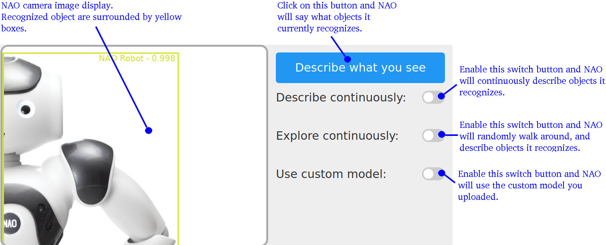

# Object recognition on NAO with Deep Learning

This application demonstrate how the NAO robot can recognize objects using deep learning algorithms.
It comes with a pre-trained deep learning model that allows NAO to recognize up to 600 different objects with its camera.

You can also train your own deep learning model on your own object image dataset and upload the model to be used in this application.

   * [1. Hardware & software compatibility](#1-hardware-&-software-compatibility)
   * [2. Supported language](#2-supported-language)
   * [3. Install the app](#3-install-the-app)
      * [3.1. Dependancies](#31-dependancies)
         * [3.1.1. Language french](#311-language-french)
      * [3.2. Install the app using Choregraphe](#32-install-the-app-using-choregraphe)
   * [4. Use the app](#4-use-the-app)
      * [4.1. Start the app](#41-start-the-app)
      * [4.2. Recognized objects](#42-recognized-objects)
      * [4.3. Remote control the app via its web page](#43-remote-control-the-app-via-its-web-page)
         * [4.3.1. Open the page in your internet browser](#431-open-the-page-in-your-internet-browser)
         * [4.3.2. Application disabled](#432-application-disabled)
      * [4.4. Interact with the app via the web page](#44-interact-with-the-app-via-the-web-page)
   * [5. Training your custom model](#5-training-your-custom-model)
   * [6. Uploading your custom model to the app](#6-uploading-your-custom-model-to-the-app)

# Video

Please see the following video on YouTube for some more information about how this project works in practice: https://youtu.be/NwHXtjw7TG0

## 1. Hardware & software compatibility

This app is compatible with NAO V6, and [Naoqi 2.8.6](https://developer.softbankrobotics.com/blog/nao6/naoqi-developer-guide/nao6-naoqi-28-286-release-note)

## 2. Supported language

This app is available in:

* French
* English

The application will automatically switch to English or French language when you [change the language on NAO](https://developer.softbankrobotics.com/nao6/nao-documentation/nao-user-guide/configuring-and-settings/setting-nao-s-preferred-language#-modifying-the-preferred-language-)

## 3. Install the app

### 3.1. Dependancies

#### 3.1.1. Language french

If you want to use the Deep NAO app in French, you need to have the French language installed on your robot. If it is not installed by default, [you can order the French language by contacting customer support](https://developer.softbankrobotics.com/nao6/nao-documentation/nao-user-guide/configuring-and-settings/setting-nao-s-preferred-language#-ordering-additional-languages-).

### 3.2. Install the app using Choregraphe

To install this application on your NAO, you need to use the [Choregraphe suite](https://developer.softbankrobotics.com/nao6/naoqi-developer-guide/choregraphe-suite/what-choregraphe).

First launch Choregraphe. Click on **`File` > `Open Project`**, select the `deep_nao.pml` file located in this project folder, then click **`Open`**.

Then [connect Choregraphe to your NAO robot](https://developer.softbankrobotics.com/nao6/naoqi-developer-guide/choregraphe-suite/connecting-choregraphe-robot#chore-howto-connect).

Finally open the [Robot applications panel](https://developer.softbankrobotics.com/nao6/naoqi-developer-guide/choregraphe-suite/main-panels/robot-applications-panel#-what-is-the-robot-applications-panel-), and click on the `Package and install current project to the robot` icon , located in the [Robot application panel toolbar](https://developer.softbankrobotics.com/nao6/naoqi-developer-guide/choregraphe-suite/main-panels/robot-applications-panel#app-man-toolbar). This will package and install the Deep NAO application to your NAO robot.

Once this is done, you can close Choregraphe, the app has been installed on your NAO.

## 4. Use the app

### 4.1. Start the app

The app start automatically when the robot is in [solitary](https://developer.softbankrobotics.com/nao6/naoqi-developer-guide/programming-living-robot/state-machine-management#-states-) or [interactive](https://developer.softbankrobotics.com/nao6/naoqi-developer-guide/programming-living-robot/state-machine-management#-states-) state. It is stopped when the robot is in [disabled](https://developer.softbankrobotics.com/nao6/naoqi-developer-guide/programming-living-robot/state-machine-management#-states-) or [safeguard](https://developer.softbankrobotics.com/nao6/naoqi-developer-guide/programming-living-robot/state-machine-management#-states-) state. To enable the application when the robot is in [disabled](https://developer.softbankrobotics.com/nao6/naoqi-developer-guide/programming-living-robot/state-machine-management#-states-) state, [double click on NAO chest button](https://developer.softbankrobotics.com/nao6/nao-documentation/nao-user-guide/daily-use/switching-autonomous-life-and#nao-freeze).

### 4.2. Recognized objects

We provide a default deep learning model that was trained on [Google Open Image Dataset](https://storage.googleapis.com/openimages/web/index.html). Using this model, NAO can recognize up to 600 different objects.

You can view the complete list of recognized object in [this file](models/ssd_mobilenet_v2_oid_v4/objects.names.en) (open it with a text editor).

### 4.3. Remote control the app via its web page

#### 4.3.1. Open the page in your internet browser

A web page is available that allows you to remote control the application.
You can access it at the url: `http://<robot_ip>/apps/deep_nao/`

Replace `<robot_ip>` by the [real ip of the NAO robot](https://developer.softbankrobotics.com/nao6/nao-documentation/nao-user-guide/daily-use/requesting-technical-information#-reading-ip-address-and-notifications-) (for instance something like 192.168.0.2).

#### 4.3.2. Application disabled

If the application is disabled, the web page will display the following message:

    

In that case, see [4.1. Start the app](#41-start-the-app) to find out how to start the application.

### 4.4. Interact with the app via the web page

When the Deep NAO application is running, the remote control webpage looks as follow:

    

When the app is active, the web page will display NAO camera stream, so that you can see what objects NAO sees and recognizes.
When NAO recognizes an object, it will display a yellow square around the object in the camera stream image. The name of the object will also be displayed.

You can ask NAO to say the name of the objects it recognizes. To do so you can either:

* click on the `Describe what you see` button: NAO will say what object it recognizes at the moment
* toggle the `Describe continuously` switch button: Whenever NAO recognizes a new object, it will say its name. It will continue doing so until you toggle back the switch to off.
* toggle the `Explore continuously` switch button: NAO will start to walk randomly in the room to search for objects to describe. As with the `Describe continuously` button, whenever it recognize a new object it will say its name.

When you have uploaded a custom model to the app, a `Use custom model` switch will appear. Toggle it if you want NAO to use your custom model.

## 5. Training your custom model

You can train your own custom model so that NAO recognizes the objects you taught it to learn.

We provide a tutorial in the form of a [Google Colab notebook tutorial](https://colab.research.google.com/github/softbankrobotics-labs/nao-deep-learning/blob/master/notebook/NAO_Deep_Learning_Custom_Model_Training.ipynb) that allow you to train a custom network to recognize two different objects. You can pick these two objects from the 600 objects available in the [Google Open Image dataset](https://storage.googleapis.com/openimages/web/index.html).

Now go to the [Colab tutorial](https://colab.research.google.com/github/softbankrobotics-labs/nao-deep-learning/blob/master/notebook/NAO_Deep_Learning_Custom_Model_Training.ipynb), and follow the instructions!

## 6. Uploading your custom model to the app

Once you have trained your custom model using the [Colab tutorial](https://colab.research.google.com/github/softbankrobotics-labs/nao-deep-learning/blob/master/notebook/NAO_Deep_Learning_Custom_Model_Training.ipynb), download the resulting files from your Google Drive.
The tutorial should have created a folder `NAO_DeepLearning` in your Google drive, with a `result` folder in it. Download all the files from the `NAO_DeepLearning/result` folder. There should be the following files:

* `model.cfg`
* `model.weights`
* `objects.names.en`
* `objects.names.fr`

Once you have these four files, you need to upload them to the Deep NAO app. To do so, open the special url: `http://<robot_ip>/apps/deep_nao/upload.html` in your browser.

Replace `<robot_ip>` by the [real ip of the NAO robot](https://developer.softbankrobotics.com/nao6/nao-documentation/nao-user-guide/daily-use/requesting-technical-information#-reading-ip-address-and-notifications-) (for instance something like 192.168.0.2).

Your browser will display:

    

Click on each browse button to select the four files you just donwloaded. Then click on upload files.
Once the upload is done, you will be redirected to the Deep NAO main web page. Toggle the `Use custom model`  switch and NAO will start using your custom model instead of the default one.

If you want to revert to the default model, toggle back the `Use custom model`  switch.
